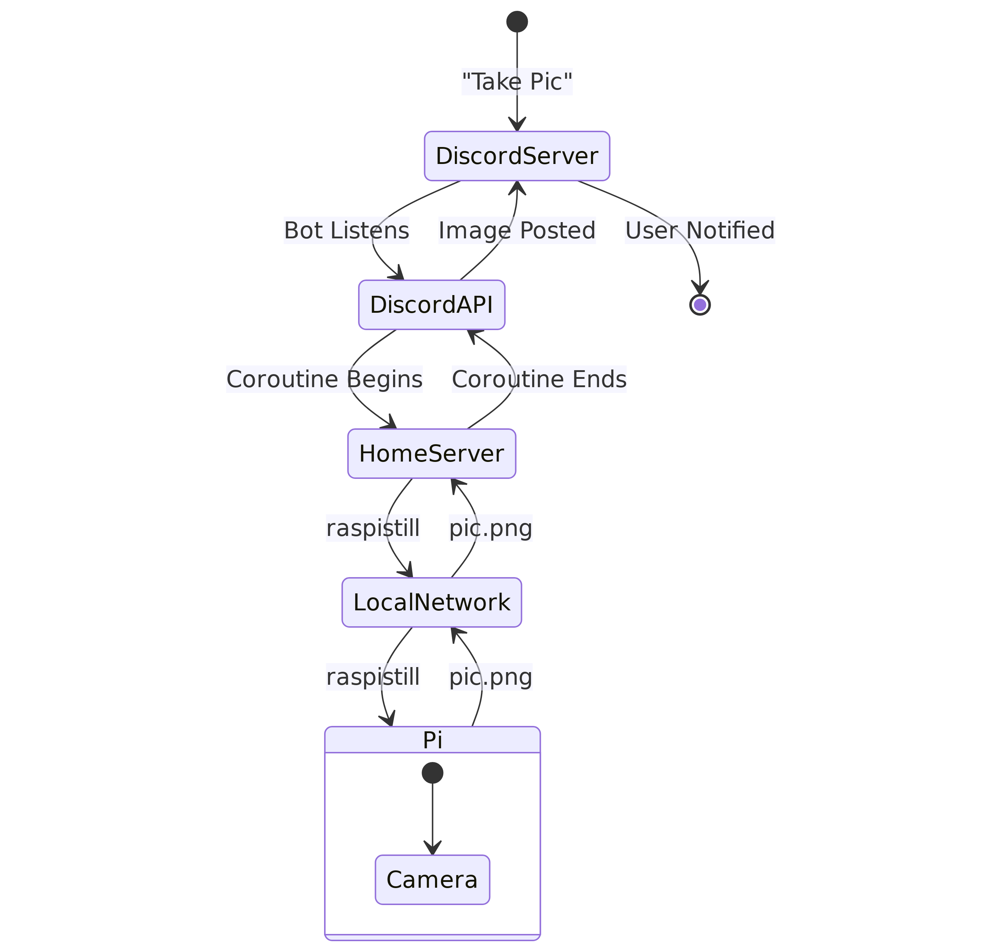

odd-pi
================

<!-- WARNING: THIS FILE WAS AUTOGENERATED! DO NOT EDIT! -->

> **O**bject **D**etection over **D**iscord using the Raspberry **PI**

See [Documentation](https://jvivian.github.io/odd-pi) for more details

## Quickstart

- Setup Raspberry Pi with Camera and allow SSH
- On a different machine:
  - `git clone https://github.com/jvivian/odd-pi && cd odd-pi && pip install ./`
  - Set required env variables in `.env` file
  - `python scripts/launch_discord_bot.py run_discord_bot --help`
- Run an active camera at given interval which looks for a specified
  object and posts it to Discord
- Type `pi!` (or given keyword) in any channel to get a picture taken
- Type `yolo!` (or keyword) to have a picture with predictions overlayed

## Roadmap

- [x] Add CLI to launch script
  - camera commands, etc,
- [x] Add critical CCC: Cat Camera Coroutine
  - [x] Make extensible to any class $C$ object, time duration, etc
- [ ] Avoid camera conflicts by making file names unique (or just
  deleting)
- [ ] Add console-script on install
