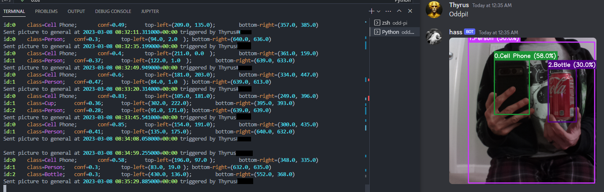

odd-pi
================

<!-- WARNING: THIS FILE WAS AUTOGENERATED! DO NOT EDIT! -->

> Library for managing Object Detection and Devices between Discord and
> Raspberry Pi

See [Documentation](https://jvivian.github.io/odd-pi) for more details

## Install

``` sh
pip install odd_pi
```

## Quickstart

- Setup Raspberry Pi with Camera and allow SSH
- On a different machine:
  - `git clone https://github.com/jvivian/odd-pi && cd odd-pi`
  - Set required env variables in `.env` file
  - `python scripts/launch_discord_bot.py`

Type `pi!` in any channel to get a picture taken and `oddpi!` to have
that picture classified by YOLOv5 and uploaded to the same channel


